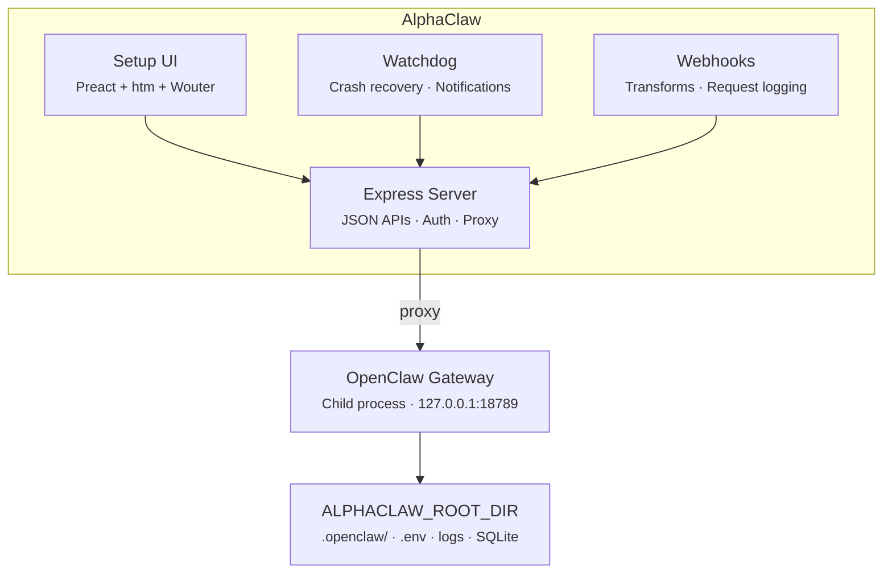

<p align="center">
  
</p>
<h1 align="center">AlphaClaw</h1>
<p align="center">
  <strong>The ultimate OpenClaw harness. Deploy in minutes. Stay running for months.</strong><br>
  <strong>Observability. Reliability. Agent discipline. Zero SSH rescue missions.</strong>
</p>

<p align="center">
  <a href="https://github.com/starfoundrystudio/alphaclaw/actions/workflows/ci.yml"></a>
  <a href="https://www.npmjs.com/package/@starfoundrystudio/alphaclaw"></a>
  <a href="LICENSE"></a>
</p>

<p align="center">AlphaClaw wraps <a href="https://github.com/openclaw/openclaw">OpenClaw</a> with a convenient setup wizard, self-healing watchdog, Git-backed rollback, and full browser-based observability. Ships with anti-drift prompt hardening to keep your agent disciplined, and simplifies integrations (e.g. Google Workspace, Google Pub/Sub, Telegram Topics, Slack, Discord) so you can manage multiple agents from one UI instead of config files.</p>

<p align="center"><em>First deploy to first message in under five minutes.</em></p>

<p align="center">
  <a href="https://railway.com/deploy/openclaw-fast-start?referralCode=jcFhp_&utm_medium=integration&utm_source=template&utm_campaign=generic"></a>
  <a href="https://render.com/deploy?repo=https://github.com/chrysb/openclaw-render-template"></a>
  <a href="https://updates.alphaclaw.md/desktop/prod/alphaclaw-mac-latest.dmg"></a>
</p>

> **Platform:** AlphaClaw currently targets Docker/Linux deployments. macOS local development is not yet supported.

## Features

- **Setup UI:** Password-protected web dashboard for onboarding, configuration, and day-to-day management.
- **Guided Onboarding:** Step-by-step setup wizard — model selection, provider credentials, optional GitHub backup, channel pairing.
- **Multi-Agent Management:** Sidebar-driven agent navigation with create, rename, and delete flows. Per-agent overview cards, channel bindings, and URL-driven agent selection.
- **Gateway Manager:** Spawns, monitors, restarts, and proxies the OpenClaw gateway as a managed child process.
- **Watchdog:** Crash detection, crash-loop recovery, auto-repair (`openclaw doctor --fix`), Telegram/Discord/Slack notifications, and a live interactive terminal for monitoring gateway output directly from the browser.
- **Channel Orchestration:** Telegram, Discord, and Slack bot pairing with per-agent channel bindings, credential sync, and a guided wizard for splitting Telegram into multi-threaded topic groups as your usage grows.
- **Google Workspace:** OAuth integration for Gmail, Calendar, Drive, Docs, Sheets, Tasks, Contacts, and Meet, plus guided Gmail watch setup with Google Pub/Sub topic, subscription, and push endpoint handling.
- **Cron Jobs:** Dedicated cron tab with job management, an interactive rolling calendar, run-history drilldowns, trend analytics, and per-run usage breakdowns.
- **Nodes:** Guided local-node setup for VPS deployments with per-node browser attach checks, reconnect commands, and routing/pairing controls.
- **Webhooks:** Named webhook endpoints with per-hook transform modules, request logging, payload inspection, editable delivery destinations, and OAuth callback support for third-party auth flows.
- **File Explorer:** Browser-based workspace explorer with file visibility, inline edits, diff view, and Git-aware sync for quick fixes without SSH.
- **Prompt Hardening:** Ships anti-drift bootstrap prompts (`AGENTS.md`, `TOOLS.md`) injected into your agent's system prompt on every message — enforcing safe practices, commit discipline, and change summaries out of the box.
- **Git Sync:** Optional automatic hourly commits of your OpenClaw workspace to GitHub with configurable cron schedule. Combined with prompt hardening, every agent action can be version-controlled and auditable.
- **Version Management:** In-place updates for both AlphaClaw and OpenClaw with in-app release notes, changelog review, and one-click apply.
- **Codex OAuth:** Built-in PKCE flow for OpenAI Codex CLI model access.

## Why AlphaClaw

- **Zero to production in one deploy:** Railway/Render templates ship a complete stack — no manual gateway setup.
- **Self-healing:** Watchdog detects crashes, enters repair mode, relaunches the gateway, and notifies you.
- **Everything in the browser:** No SSH, no config files to hand-edit, no CLI required after first deploy.
- **Stays out of the way:** AlphaClaw manages infrastructure; OpenClaw handles the AI.

## No Lock-in. Eject Anytime.

AlphaClaw simply wraps OpenClaw, it's not a dependency. Remove AlphaClaw and your agent keeps running. Nothing proprietary, nothing to migrate.

## Migrate An Existing OpenClaw Setup

If you have an older standalone OpenClaw instance and want to move it into a
fresh AlphaClaw installation, use the migration guide:

- [OpenClaw To AlphaClaw Migration](/Users/billk/Development/starfoundrystudio/alphaclaw/docs/openclaw-to-alphaclaw-migration.md)

The repo also includes helper scripts to automate most of the prep work:

- [scripts/prepare-openclaw-migration.sh](/Users/billk/Development/starfoundrystudio/alphaclaw/scripts/prepare-openclaw-migration.sh)
- [scripts/publish-openclaw-migration.sh](/Users/billk/Development/starfoundrystudio/alphaclaw/scripts/publish-openclaw-migration.sh)

## Quick Start

### Deploy (recommended)

[](https://railway.com/deploy/openclaw-fast-start?referralCode=jcFhp_&utm_medium=integration&utm_source=template&utm_campaign=generic)
[](https://render.com/deploy?repo=https://github.com/chrysb/openclaw-render-template)

Set `SETUP_PASSWORD` at deploy time and visit your deployment URL. The welcome wizard handles the rest.

> **Railway users:** after deploying, upgrade to the **Hobby plan** and redeploy to ensure your service has at least **8 GB of RAM**. The Trial plan's memory limit can cause out-of-memory crashes during normal operation.

### Local / Docker

```bash
npm install @starfoundrystudio/alphaclaw
npx alphaclaw start
```

Or with Docker:

```dockerfile
FROM node:22-slim
RUN apt-get update && apt-get install -y git curl procps cron && rm -rf /var/lib/apt/lists/*
WORKDIR /app
COPY package.json ./
RUN npm install --omit=dev
ENV PATH="/app/node_modules/.bin:$PATH"
ENV ALPHACLAW_ROOT_DIR=/data
EXPOSE 3000
CMD ["alphaclaw", "start"]
```

## Publish A Pinned Image

This repo now includes a production `Dockerfile` plus a GitHub Actions workflow
that publishes a pinned image to GHCR on tag pushes:

- Image name: `ghcr.io/<owner>/<repo>`
- Trigger: push a tag like `v0.8.7-starfoundry.1`
- Published tags:
  - `ghcr.io/<owner>/<repo>:0.8.7-starfoundry.1`
  - `ghcr.io/<owner>/<repo>:sha-<gitsha>`
  - `ghcr.io/<owner>/<repo>:latest` for stable tags without a prerelease suffix

Example release flow:

```bash
npm test
git tag v0.8.7-starfoundry.1
git push origin v0.8.7-starfoundry.1
```

The workflow in [publish-image.yml](/Users/billk/Development/starfoundrystudio/alphaclaw/.github/workflows/publish-image.yml)
builds the image, pushes it to GHCR, and records the image digest in the job
summary.

## Publish The GitHub Package

This fork also includes [publish-npm.yml](/Users/billk/Development/starfoundrystudio/alphaclaw/.github/workflows/publish-npm.yml)
for publishing `@starfoundrystudio/alphaclaw` to GitHub Packages on tag pushes.

Before enabling it, make sure:

- `package.json` uses the final scoped package name
- the repository package scope is `@starfoundrystudio`
- stable tags should publish the default package version
- prerelease tags like `v0.8.7-beta.1` should publish with the `beta` dist-tag
- internal install environments are configured to authenticate to `npm.pkg.github.com`

To deploy from a pinned image instead of building on the VPS, start from
[docker-compose.ghcr.yml](/Users/billk/Development/starfoundrystudio/alphaclaw/deploy/docker-compose.ghcr.yml)
and replace the example image reference with your published tag or digest.
That compose example keeps the runtime env in `./data/.env` so AlphaClaw and
Docker share a single env source of truth.

For a Hetzner + Tailscale deployment, use
[bootstrap-hetzner-tailscale.sh](/Users/billk/Development/starfoundrystudio/alphaclaw/deploy/bootstrap-hetzner-tailscale.sh)
with the setup notes in
[deploy/README.md](/Users/billk/Development/starfoundrystudio/alphaclaw/deploy/README.md).

Example update flow on the VPS:

```bash
docker compose -f deploy/docker-compose.ghcr.yml pull
docker compose -f deploy/docker-compose.ghcr.yml up -d
```

## Setup UI

| Tab           | What it manages                                                                                                          |
| ------------- | ------------------------------------------------------------------------------------------------------------------------ |
| **General**   | Gateway status, channel health, pending pairings, Google Workspace, repo sync schedule, OpenClaw dashboard               |
| **Browse**    | File explorer for workspace visibility, inline edits, diff review, and Git-backed sync                                   |
| **Usage**     | Token summaries, per-session and per-agent cost and token breakdown with source/agent dimension comparisons              |
| **Cron**      | Cron job management, interactive rolling calendar, run-history drilldowns, trend analytics, and per-run usage breakdowns |
| **Nodes**     | Guided local-node setup for VPS deployments, per-node browser attach, reconnect commands, and routing/pairing controls   |
| **Watchdog**  | Health monitoring, crash-loop status, auto-repair toggle, notifications, event log, live log tail, interactive terminal  |
| **Providers** | AI provider credentials (Anthropic, OpenAI, Gemini, Mistral, Voyage, Groq, Deepgram) and model selection                 |
| **Envars**    | Environment variables — view, edit, add — with gateway restart prompts                                                   |
| **Webhooks**  | Webhook endpoints, transform modules, request history, payload inspection, OAuth callbacks, Gmail watch delivery flows   |

## CLI

| Command                                                    | Description                                   |
| ---------------------------------------------------------- | --------------------------------------------- |
| `alphaclaw start`                                          | Start the server (Setup UI + gateway manager) |
| `alphaclaw git-sync -m "message"`                          | Commit and push the OpenClaw workspace        |
| `alphaclaw telegram topic add --thread <id> --name <text>` | Register a Telegram topic mapping             |
| `alphaclaw version`                                        | Print version                                 |
| `alphaclaw help`                                           | Show help                                     |

## Architecture



## Watchdog

The built-in watchdog monitors gateway health and recovers from failures automatically.

| Capability               | Details                                                                |
| ------------------------ | ---------------------------------------------------------------------- |
| **Health checks**        | Periodic `openclaw health` with configurable interval                  |
| **Crash detection**      | Listens for gateway exit events                                        |
| **Crash-loop detection** | Threshold-based (default: 3 crashes in 300s)                           |
| **Auto-repair**          | Runs `openclaw doctor --fix --yes`, relaunches gateway                 |
| **Notifications**        | Telegram, Discord, and Slack alerts for crashes, repairs, and recovery |
| **Event log**            | SQLite-backed incident history with API and UI access                  |

## Environment Variables

| Variable                          | Required | Description                                        |
| --------------------------------- | -------- | -------------------------------------------------- |
| `SETUP_PASSWORD`                  | Yes      | Password for the Setup UI                          |
| `OPENCLAW_GATEWAY_TOKEN`          | Auto     | Gateway auth token (auto-generated if unset)       |
| `GITHUB_TOKEN`                    | Optional | GitHub PAT for workspace backup repo               |
| `GITHUB_WORKSPACE_REPO`           | Optional | GitHub repo for workspace sync (e.g. `owner/repo`) |
| `ALPHACLAW_SETUP_URL`             | Optional | Canonical private Setup UI URL                     |
| `ALPHACLAW_PUBLIC_BASE_URL`       | Optional | Canonical public webhook/OAuth callback URL        |
| `ALPHACLAW_PUBLIC_EXTRA_PATH_PREFIXES` | Optional | Extra public callback path prefixes (comma-separated) |
| `ALPHACLAW_BASE_URL`              | Optional | Legacy fallback for the private Setup UI URL       |
| `TELEGRAM_BOT_TOKEN`              | Optional | Telegram bot token                                 |
| `DISCORD_BOT_TOKEN`               | Optional | Discord bot token                                  |
| `SLACK_BOT_TOKEN`                 | Optional | Slack bot token (Socket Mode)                      |
| `WATCHDOG_AUTO_REPAIR`            | Optional | Enable auto-repair on crash (`true`/`false`)       |
| `WATCHDOG_NOTIFICATIONS_DISABLED` | Optional | Disable watchdog notifications (`true`/`false`)    |
| `PORT`                            | Optional | Server port (default `3000`)                       |
| `ALPHACLAW_ROOT_DIR`              | Optional | Data directory (default `/data`)                   |
| `TRUST_PROXY_HOPS`                | Optional | Trust proxy hop count for correct client IP        |

## Private UI + Public Callbacks

If you want the AlphaClaw UI to stay private on Tailscale while still supporting public webhooks or OAuth callbacks, configure:

```bash
ALPHACLAW_SETUP_URL=https://alphaclaw.tail123.ts.net
ALPHACLAW_PUBLIC_BASE_URL=https://callbacks.example.com
ALPHACLAW_PUBLIC_EXTRA_PATH_PREFIXES=/googlechat,/api/messages
```

Behavior when both `ALPHACLAW_SETUP_URL` and `ALPHACLAW_PUBLIC_BASE_URL` are set:

- The full Setup UI is only served on `ALPHACLAW_SETUP_URL`
- The public host only serves callback/webhook paths:
  `/hooks/*`, `/webhook/*`, `/oauth/*`, `/gmail-pubsub`, `/auth/google/callback`
- Any extra public plugin or gateway paths must be explicitly added via `ALPHACLAW_PUBLIC_EXTRA_PATH_PREFIXES`
- Any other request on the public host returns `404`

Use `ALPHACLAW_BASE_URL` only as a legacy fallback if you have older deployments to preserve.

## Security Notes

AlphaClaw is a convenience wrapper — it intentionally trades some of OpenClaw's default hardening for ease of setup. You should understand what's different:

| Area                    | What AlphaClaw does                                                                                                                   | Trade-off                                                                                              |
| ----------------------- | ------------------------------------------------------------------------------------------------------------------------------------- | ------------------------------------------------------------------------------------------------------ |
| **Setup password**      | All gateway access is gated behind a single `SETUP_PASSWORD`. Brute-force protection is built in (exponential backoff lockout).       | Simpler than OpenClaw's pairing code flow, but the password must be strong.                            |
| **One-click pairing**   | Channel pairings (Telegram/Discord/Slack) can be approved from the Setup UI instead of the CLI.                                       | No terminal access required, but anyone with the setup password can approve pairings.                  |
| **Auto CLI approval**   | The first CLI device pairing is auto-approved so you can connect without a second screen. Subsequent requests appear in the UI.       | Removes the manual pairing step for the initial CLI connection.                                        |
| **Query-string tokens** | Webhook URLs support `?token=<WEBHOOK_TOKEN>` for providers that don't support `Authorization` headers. Warnings are shown in the UI. | Tokens may appear in server logs and referrer headers. Use header auth when your provider supports it. |
| **Gateway token**       | `OPENCLAW_GATEWAY_TOKEN` is auto-generated and injected into the environment so the proxy can authenticate with the gateway.          | The token lives in the `.env` file on the server — standard for managed deployments but worth noting.  |

If you need OpenClaw's full security posture (manual pairing codes, no query-string tokens, no auto-approval), use OpenClaw directly without AlphaClaw.

## Development

```bash
npm install
npm run build:ui        # Generate Setup UI bundle, Tailwind CSS, and vendor CSS (required for local runs from a git checkout)
npm test                # Full suite (440 tests)
npm run test:watchdog   # Watchdog-focused suite (14 tests)
npm run test:watch      # Watch mode
npm run test:coverage   # Coverage report
```

**Requirements:** Node.js ≥ 22.14.0

## License

MIT
